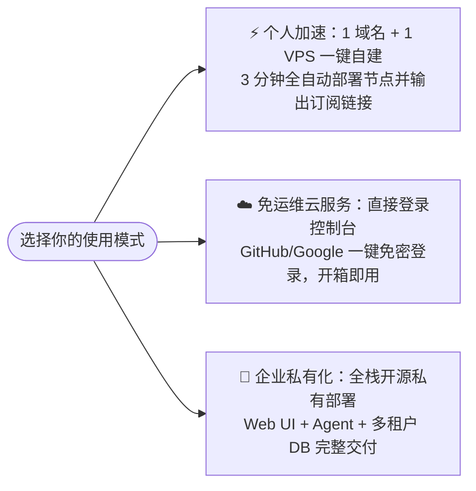

<div align="center">


# AI Workspace Services 🌐

**开放的 AI 云原生服务底座 · 赋能下一代 AI 工作空间、全球低延迟连接与智能协作**  
*The Open AI Cloud-Native Foundation — Powering Next-Gen AI Workspaces, Global Low-Latency Interconnect & Autonomous Collaboration.*

<br />

<p align="center">
  <a href="https://console.svc.plus/"><strong>🚀 进入统一控制台 / Launch Console</strong></a>
  &nbsp;·&nbsp;
  <a href="https://console.svc.plus/products/xconnect"><strong>⚡ XConnect 加速连接器</strong></a>
  &nbsp;·&nbsp;
  <a href="https://console.svc.plus/products/xworkmate"><strong>🤖 XWorkmate AI 协作工作空间</strong></a>
</p>

<p align="center">
  <a href="https://console.svc.plus/"></a>
  
  <a href="https://github.com/ai-workspace-xstream"></a>
  
</p>

<p align="center">
  <a href="#-中文主页">🇨🇳 中文介绍</a> ｜ <a href="#-english-guide">🇬🇧 English Overview</a>
</p>

</div>

---

## 🇨🇳 中文主页

### 💡 为什么选择 AI Workspace Services？

在 AI 工具与工作流全面爆发的时代，开发者与团队常常面临三大痛点：**跨国 API 网络延迟高与频繁丢包**、**多工具与长周期任务协同割裂**、以及**私有化基础设施运维繁琐**。

`ai-workspace-services` 是一套**持续在线运行的企业级生产底座**，为个人开发者、AI 创作者与团队提供开箱即用、自建可选的统一解决方案。

---

### 🌟 核心产品矩阵

| 产品 / 模块 | 核心能力与价值 | 适用场景 | 快速入口 |
| :--- | :--- | :--- | :--- |
| ⚡ **XConnect / XStream** | **AI 工作空间连接与智能加速**<br/>• 针对 Cursor / Claude / ChatGPT 流式交互深度调优<br/>• 支持 1 域名 + 1 VPS 3 分钟一键自建，或云端开箱即用<br/>• 内核级 BBR + FQ 低延迟优化，全自动 TLS 证书 | 开发者、海外 AI 重度用户、跨国协作团队 | [了解详情](https://console.svc.plus/products/xconnect) · [一键自建](https://github.com/ai-workspace-xstream/agent.svc.plus) |
| 🤖 **XWorkmate** | **智能任务协作与 AI 工作空间**<br/>• 面向长周期、多步骤任务的持续自治推进<br/>• 多 Agent 协同与上下文持久化管理 | 自动化研发、知识工作流、多智能体协同 | [进入工作台](https://console.svc.plus/products/xworkmate) |
| 🛡️ **Open-Platform Core** | **统一身份底座与多租户管理**<br/>• 支持 GitHub / Google OAuth 一键安全登录<br/>• 租户隔离、密钥管理与全链路可观测性 | 企业私有化、团队多组织管理 | [访问控制台](https://console.svc.plus/) |

---

### 🧭 极速开始向导



- **🚀 3 分钟一键自建节点**（需 1 台 VPS + 1 个解析好的域名）：
  ```bash
  curl -fsSL https://raw.githubusercontent.com/cloud-neutral-toolkit/agent.svc.plus/main/scripts/setup-proxy.sh | \
    bash -s -- --node xhttp.example.com
  ```
- **📱 跨平台自研客户端**：下载 **[XConnect App (85% 完成度预览版)](https://github.com/ai-workspace-xstream/xconnect-app/releases/tag/main-149)**（支持 macOS / Windows / iOS / Linux）。
- **🌐 云端免运维即刻使用**：直接访问 **[console.svc.plus](https://console.svc.plus/)**。

---

## 🇬🇧 English Guide

### 💡 Why AI Workspace Services?

As modern AI workflows evolve, builders and teams face common friction: **high latency and packet loss when querying overseas AI APIs**, **fragmented long-running task collaboration**, and **high operational overhead for self-hosted infrastructure**.

`ai-workspace-services` provides a battle-tested, **always-on production foundation** that unifies identity, AI workspace collaboration, and ultra-low-latency global network interconnect.

---

### 🌟 Core Product Suite

| Product | Key Capabilities | Best For | Link |
| :--- | :--- | :--- | :--- |
| ⚡ **XConnect / XStream** | **AI Workspace Acceleration & Connectivity**<br/>• Optimized for Cursor, Claude, ChatGPT streaming latency<br/>• 3-min 1-click self-host (1 Domain + 1 VPS) or fully managed SaaS<br/>• Kernel-level BBR+FQ pacing, auto Let's Encrypt TLS | Developers, AI power users, global teams | [Overview](https://console.svc.plus/products/xconnect) · [One-Click Script](https://github.com/ai-workspace-xstream/agent.svc.plus) |
| 🤖 **XWorkmate** | **Autonomous AI Workspace & Task Orchestration**<br/>• Persistent context execution for multi-step AI workflows<br/>• Multi-agent team collaboration and state tracking | Automated engineering, knowledge pipelines | [Launch XWorkmate](https://console.svc.plus/products/xworkmate) |
| 🛡️ **Open-Platform Core** | **Unified Identity & Multi-Tenant Core**<br/>• One-click sign-in with GitHub and Google OAuth<br/>• Tenant isolation, secret governance, and observability | Enterprise self-hosting, team management | [Console Home](https://console.svc.plus/) |

---

### 🧭 Quick Start Options

1. **🚀 3-Minute Quick Self-Host**:
   ```bash
   curl -fsSL https://raw.githubusercontent.com/cloud-neutral-toolkit/agent.svc.plus/main/scripts/setup-proxy.sh | \
     bash -s -- --node xhttp.example.com
   ```
2. **📱 Native Client**: Download **[XConnect Client Preview](https://github.com/ai-workspace-xstream/xconnect-app/releases/tag/main-149)** (macOS / Windows / iOS / Linux).
3. **☁️ Zero-Ops Cloud**: Log in directly to **[console.svc.plus](https://console.svc.plus/)** with GitHub / Google OAuth.

---

<div align="center">

**[🚀 立即访问统一控制台 / Visit Console](https://console.svc.plus/)** · **[🏢 开源生态 / Open Source Ecosystem](https://github.com/ai-workspace-xstream)**

</div>
