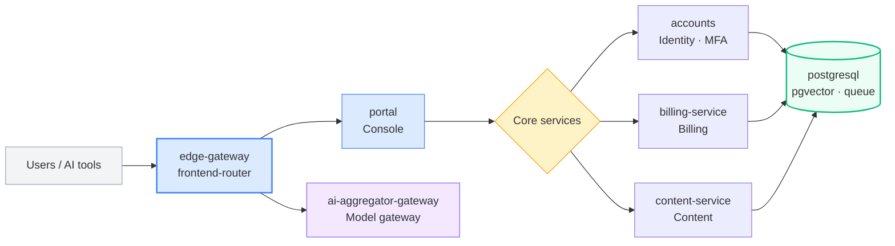

<!-- Target: ai-workspace-services/.github → profile/README.md (Chinese: profile/README_ZH.md) -->
<!-- Style mirrors ai-workspace-infra/.github profile/README.md. Spec: org-homepage-handoff.md -->

<p align="center">
  
</p>

<h1 align="center">ai-workspace-services</h1>
<p align="center"><strong>Open Cloud-Native Services for AI Workspaces | 开放的 AI 云原生服务底座</strong></p>

<p align="center">
  <a href="https://console.svc.plus"></a>
  <a href="https://github.com/ai-workspace-services"></a>
  <a href="https://github.com/ai-workspace-services?tab=repositories"></a>
  <a href="#-quick-start"></a>
  <a href="https://github.com/ai-workspace-services/accounts"></a>
</p>

<p align="center">
  <strong>🌐 English</strong> ｜ <a href="https://github.com/ai-workspace-services/.github/blob/main/profile/README_ZH.md">🇨🇳 简体中文</a>
</p>

---

## 🌐 Overview

`ai-workspace-services` is the application-services organization of AI Workspace Lab, built on top of [`ai-workspace-infra`](https://github.com/ai-workspace-infra). We combine unified identity, AI collaboration workspaces and a low-latency global network into a managed or self-hosted stack.

### Product Principles

- **Open, no lock-in**: every service is Apache-2.0, self-hostable and portable.
- **One identity**: a single account across console, billing and every product, with GitHub / Google sign-in.
- **Latency first**: networking tuned for streaming in AI tools like Cursor, Claude and ChatGPT.
- **Multi-tenant by default**: tenant isolation, secret governance and observability out of the box.

### Quick Links

- **Console**: [console.svc.plus](https://console.svc.plus)
- **Docs & knowledge base**: [knowledge](https://github.com/ai-workspace-services/knowledge)
- **Infrastructure org**: [ai-workspace-infra](https://github.com/ai-workspace-infra)

---

## 🧩 Core Products

<table>
<tr>
<td width="33%" align="center" valign="top">
  <h3>⚡<br/><a href="https://console.svc.plus/products/xstream">XConnect</a></h3>
  <p><strong>AI Workspace Acceleration</strong></p>
  <p align="left"><sub>Lower streaming latency for AI tools. Kernel-level BBR + FQ, automatic TLS. Self-host with 1 VPS + 1 domain, or use managed SaaS.</sub></p>
</td>
<td width="33%" align="center" valign="top">
  <h3>🤖<br/><a href="https://console.svc.plus/products/xworkmate">XWorkmate</a></h3>
  <p><strong>Autonomous AI Workspace</strong></p>
  <p align="left"><sub>Persistent context for multi-step AI workflows. Multi-agent team collaboration with state tracking.</sub></p>
</td>
<td width="33%" align="center" valign="top">
  <h3>🛡️<br/><a href="https://console.svc.plus">Open-Platform Core</a></h3>
  <p><strong>Unified Identity & Multi-Tenancy</strong></p>
  <p align="left"><sub>One-click GitHub / Google OAuth, tenant isolation, secret governance and end-to-end observability.</sub></p>
</td>
</tr>
</table>

---

## 🔀 Service Architecture


```mermaid
flowchart LR
    U[Users / AI tools] --> E[edge-gateway<br/>frontend-router]
    E --> P[portal<br/>Console]
    E --> G[ai-aggregator-gateway<br/>Model gateway]
    P --> S{Core services}
    S --> A[accounts<br/>Identity · MFA]
    S --> B[billing-service<br/>Billing]
    S --> C[content-service<br/>Content]
    A & B & C --> D[(postgresql<br/>pgvector · queue)]

    style U fill:#F3F4F6,stroke:#9CA3AF,stroke-width:1px
    style E fill:#DBEAFE,stroke:#3B82F6,stroke-width:2px
    style P fill:#DBEAFE,stroke:#3B82F6,stroke-width:1px
    style G fill:#F3E8FF,stroke:#8B5CF6,stroke-width:1px
    style S fill:#FEF3C7,stroke:#F59E0B,stroke-width:1px
    style D fill:#ECFDF5,stroke:#10B981,stroke-width:2px
```

---

## 🚀 Quick Start

| Path | Best for | How |
| :--- | :--- | :--- |
| ☁️ **Zero-ops cloud** | Try it now | Sign in at [console.svc.plus](https://console.svc.plus) with GitHub / Google |
| 📱 **Native client** | Daily use | [Download XConnect preview](https://console.svc.plus/products/xstream) (macOS / Windows / iOS / Linux) |
| 🖥️ **Self-hosted control plane** | Run Accounts, Billing, Console/Portal, Content and PostgreSQL | [Deployment and migration guide](../docs/control-plane-deployment-and-migration.md); isolated integration acceptance pending |
| 🔌 **Edge node onboarding** | Add one XConnect edge node to an existing control plane | Existing node installer and node credential contract |

| Script | Purpose | Inputs |
| :--- | :--- | :--- |
| [`install-control-plane.sh`](../scripts/install-control-plane.sh) | Fixed-commit Playbooks delegation | `--config`, full-SHA `--gitops-ref`, optional `--check` |
| [`migrate-core-data.sh`](../scripts/migrate-core-data.sh) | Accounts migration client for one-way core data transfer; isolated API acceptance pending | `MIGRATECTL_BIN` / `MIGRATECTL_SHA256`, source/target URL and authentication references; preview by default |
| [`setup-proxy.sh`](../scripts/setup-proxy.sh) | Edge node onboarding | Existing `--node` interface; unchanged implementation |

Control-plane candidate interface, from a reviewed immutable checkout:

```bash
export CONTROL_PLANE_CMDB='/secure/run/cmdb.json'
export CONTROL_PLANE_VARS_FILE='/secure/run/vars.yaml'
bash scripts/install-control-plane.sh \
  --config '<GitOps-relative YAML>' --gitops-ref '<full 40-character SHA>' --check
```

The wrapper requires Git, Python 3 and PyYAML; it fetches the fixed canonical
GitOps commit, its `execution.playbooks_sha`, and Billing at
`release.billing.source_sha` from three fixed canonical repositories, then passes
`BILLING_CHECKOUT` to the owner. Billing's schema path is fixed to
`sql/billing-service-schema.sql`; the owner verifies its reviewed digest and
applies empty-database DDL. No extra public flags are needed. Formal releases
provide fixed script URLs. This candidate is not yet marked runtime available.
`CONTROL_PLANE_VARS_FILE` holds nonsecret runtime policy and Vault references;
Playbooks resolves credentials inside the owner, without plaintext credentials in this file.
Before apply, the installer invokes the fixed Playbooks `vhosts/common`
controller preparation helper in a private collection directory, then parses
roles and deploys. `--check` does not install collections or contact hosts.

```bash
# Edge node onboarding; replace with a reviewed immutable release or full SHA.
curl -fsSL 'https://raw.githubusercontent.com/ai-workspace-services/.github/<release-or-SHA>/scripts/setup-proxy.sh' \
  | bash -s -- --node xhttp.example.com
```

Eight stages: **1** GitOps configuration → **2** IaC and CMDB → **3** five-repository
build snapshot → **4** install control plane → **5** one-way data migration →
**6** full candidate acceptance → **7** prepare handover for confirmation →
**8** confirmed writer/traffic handover and business acceptance.

Fresh deployment runs 1–4 and 6, recording why migration is skipped. Generation
upgrades run all eight; rolling updates use backup, non-destructive convergence
and explicit incremental migrations. PostgreSQL remains tunnel-only. The five
build repositories are `accounts`, `billing-service`, `portal`, `content-service`
and `postgresql`; snapshots are build-only, not deployment authorization.
Verify Actions/workflow settings and the actual dispatch identity first. For r101
all five tags exist; four service CI runs and release manifests were verified,
but PostgreSQL release is absent. GitHub App dispatch returned HTTP 422 again on
attempt 2, while personal admin API reports `enabled: true` / workflow `active`.
These observations show a rejected App dispatch path; they do not establish
globally disabled Actions.
Builds remain incomplete. No more build retries until actor configuration is
resolved; unchanged source keeps its tag, and only changed source SHA needs a new
immutable revision. Never move tags. [Build evidence](../docs/control-plane-deployment-and-migration.md#immutable-builds-and-releases).

Migration URL/API mode is pending isolated acceptance. Existing V4 lacks the new
API; V4→V5 retains the reviewed SSH/database path, with no implicit URL fallback.
See the [guide and existing V2/V3/V4 records](../docs/control-plane-deployment-and-migration.md#historical-records).

---

## 📦 Repositories (10)

| Repository | Type | Description |
| :--- | :--- | :--- |
| [`portal`](https://github.com/ai-workspace-services/portal) | `Control Panel` | Open cloud control panel — "escape pods" from vendor lock-in |
| [`accounts`](https://github.com/ai-workspace-services/accounts) | `Identity & Auth` | Production-ready auth, MFA and agent coordination; core of svc.plus |
| [`billing-service`](https://github.com/ai-workspace-services/billing-service) | `Billing` | Billing and subscriptions |
| [`content-service`](https://github.com/ai-workspace-services/content-service) | `Content API` | Content management and delivery |
| [`edge-gateway`](https://github.com/ai-workspace-services/edge-gateway) | `Edge Ingress` | Edge ingress gateway |
| [`frontend-router`](https://github.com/ai-workspace-services/frontend-router) | `Routing` | Frontend routing and multi-site dispatch |
| [`ai-aggregator-gateway`](https://github.com/ai-workspace-services/ai-aggregator-gateway) | `AI Gateway` | AI aggregator contracts, adapters and Home-Lab bundle |
| [`postgresql`](https://github.com/ai-workspace-services/postgresql) | `Database & Vector` | PostgreSQL + vector search + Chinese tokenization + queue |
| [`knowledge`](https://github.com/ai-workspace-services/knowledge) | `Knowledge Base` | Engineering guides, articles and workshop docs |
| [`.github`](https://github.com/ai-workspace-services/.github) | `Org Profile & CI` | Org profile, setup script and release automation |

---

## 🚦 Release Status

Registry discovery below shows artifact availability only, not deployment or runtime acceptance.

<!-- RELEASES:START — generated by CI, do not edit by hand -->
| Env | Purpose | Status | Latest | Updated (UTC) |
| :--- | :--- | :--- | :--- | :--- |
| `prod` | Production |  | — | — |
| `uat` | Pre-release |  | `uat-platform-rebuild-2026.07.27-r4` | 2026-07-27 05:38 |
| `sit` | Integration |  | `4a7176c` | 2026-07-27 05:40 |

<details>
<summary>Image tags</summary>

| Env | Image | Tag |
| :--- | :--- | :--- |
| sit | console | `4a7176c` |
| uat | accounts | `ca13285` · `latest` |
| uat | billing-service | `uat-platform-rebuild-2026.07.27-r4` |
| uat | docs | `uat-platform-rebuild-2026.07.27-r4` |
| uat | postgresql | `uat-platform-rebuild-2026.07.27-r4` |

</details>
<!-- RELEASES:END -->

---

<p align="center">
  <strong>Open · Unified · Low-Latency · Self-Hostable · AI-Native</strong><br/>
  <sub>开放 · 统一 · 低延迟 · 可自建 · AI 原生</sub>
</p>
